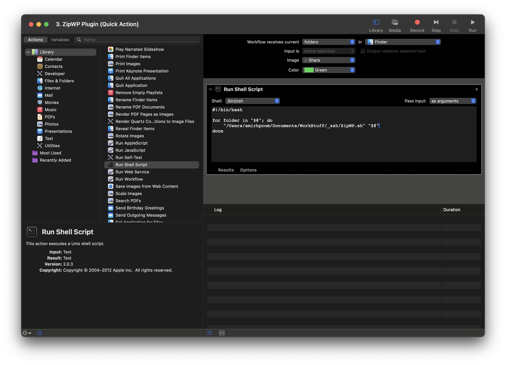
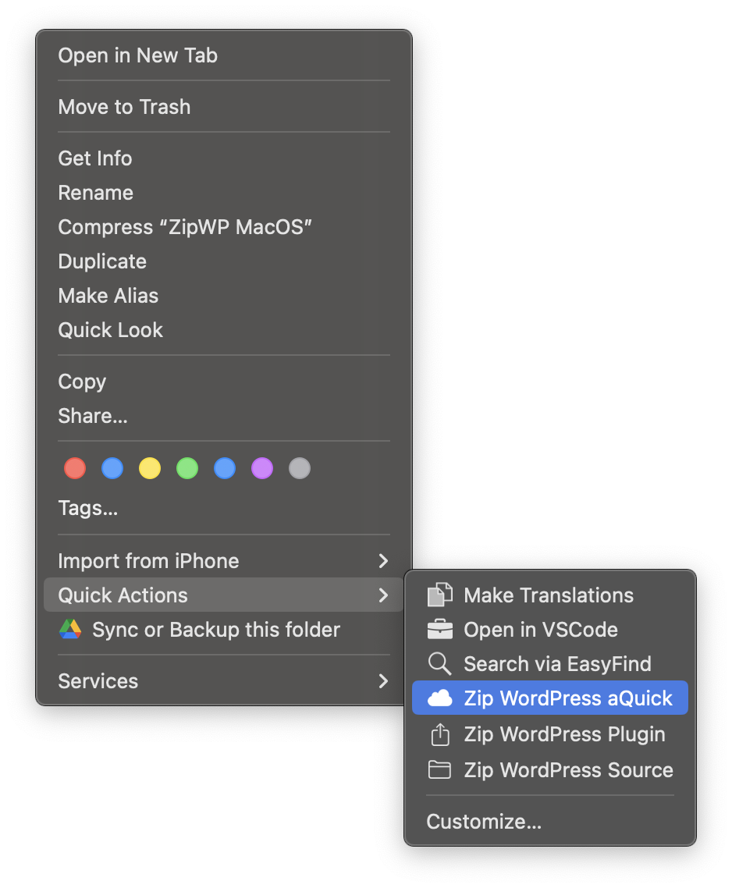
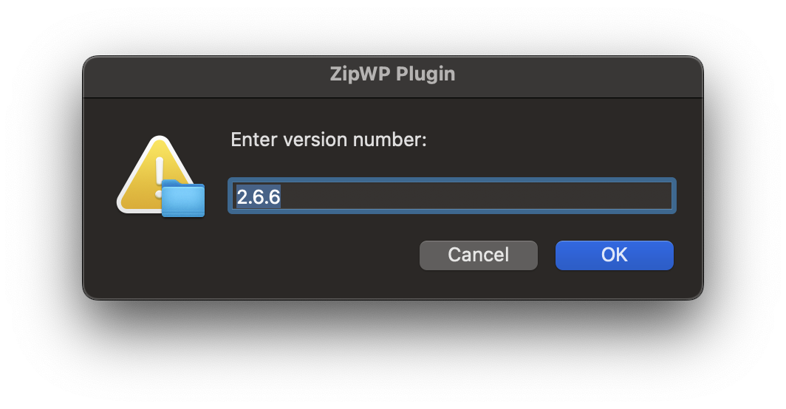

# **ZipWP Quick Actions for macOS Finder**

This repository contains a set of macOS Finder Quick Actions designed to streamline the process of creating WordPress plugins and source archives. These Quick Actions allow you to quickly zip a folder, removing unnecessary files, and automatically setting a version suffix on the archive. The tools are perfect for developers who need a fast and reliable way to prepare WordPress plugins for distribution.

**Developed by [Amirhp.Com](https://Amirhp.Com/)** 🦖

## **Why This Project?**

If you've ever compressed a folder on macOS and tried to use that zip file as a WordPress plugin, you might have noticed that it doesn't always work as expected. Extra files and folders (like `.DS_Store`) often get included, and the folder structure may not be ideal. This project aims to solve these problems by automating the process, ensuring you always get a clean, versioned zip file ready for WordPress.

## **Features**

- **ZipWP Plugin**: Creates a zip file of the selected folder as a ready-to-install WordPress plugin. The version is automatically detected from your files, and you can edit it via a popup.
- **ZipWP Source**: Archives the entire source code while preserving the folder structure. The version suffix is appended to the zip file.
- **ZipWP Plugin Quick**: Instantly creates a share-ready zip file without prompting for the version.

These Quick Actions are designed to eliminate the hassle of manually removing unnecessary files such as `.git`, `.gitignore`, `.vscode`, `.DS_Store`, and others, ensuring a clean and lightweight plugin package.

## **Getting Started**

### **Installation & Setup**

1. **Clone this repository** to your local machine:

   ```bash
   git clone https://github.com/amirhp-com/ZipWP-MacOS.git
   ```

2. **Add the Quick Actions** to macOS Automator:

   - Open **Automator**.
   - Choose **Quick Action**.
   - Drag and drop the relevant script from the cloned repository into the workflow area.
   - Set **Workflow receives current** to `files or folders in Finder`.
   - **Set pass input**: `as arguments`
   - Save the Quick Action with a name like `ZipWP Plugin`, `ZipWP Source`, or `ZipWP Plugin Quick`.

3. **Assign Icons to Quick Actions**:
   - Right-click on the saved Quick Action file.
   - Select `Get Info`.
   - Drag your custom icon to the top-left corner of the Get Info window.

### **Using the Quick Actions**

1. **Right-click** on the folder containing the WordPress plugin or source code.
2. **Select** the desired Quick Action from the `Quick Actions` menu:

   - **ZipWP Plugin**: Opens a popup asking for the plugin version. The detected version is pre-filled, but you can edit it.
   - **ZipWP Source**: Similar to ZipWP Plugin, but preserves the entire source code structure.
   - **ZipWP Plugin Quick**: Instantly creates a versioned zip file without further input.

3. **Locate the generated zip file** in the same directory as your original folder.

### **Example Workflow**

1. **ZipWP Plugin**:

   - Right-click on your plugin folder.
   - Choose `ZipWP Plugin` from Quick Actions.
   - Enter a version number if needed.
   - Find the `plugin-name-vX.X.X.zip` file ready for use in your WordPress projects.

2. **ZipWP Source**:
   - Right-click on your source folder.
   - Select `ZipWP Source` from Quick Actions.
   - The complete source with a versioned name is zipped and saved.

### **Screenshots**


_Figure 1: ZipWP in macOS Automator, carefully check everything be same_



_Figure 2: Quick Action Menu in Finder_


_Figure 3: Version Input Dialog_


## **Contributing**

We welcome contributions! If you’d like to improve this project or add new features:

- Fork the repository.
- Create a new branch for your feature or fix.
- Submit a pull request.

Please make sure your code adheres to our guidelines and includes relevant tests.

## **License**

This project is licensed under the MIT License.

Copyright 2024 Amirhossein Hosseinpour (Amirhp.Com)

Permission is hereby granted, free of charge, to any person obtaining a copy of this software and associated documentation files (the “Software”), to deal in the Software without restriction, including without limitation the rights to use, copy, modify, merge, publish, distribute, sublicense, and/or sell copies of the Software, and to permit persons to whom the Software is furnished to do so, subject to the following conditions:

The above copyright notice and this permission notice shall be included in all copies or substantial portions of the Software.

THE SOFTWARE IS PROVIDED “AS IS”, WITHOUT WARRANTY OF ANY KIND, EXPRESS OR IMPLIED, INCLUDING BUT NOT LIMITED TO THE WARRANTIES OF MERCHANTABILITY, FITNESS FOR A PARTICULAR PURPOSE AND NONINFRINGEMENT. IN NO EVENT SHALL THE AUTHORS OR COPYRIGHT HOLDERS BE LIABLE FOR ANY CLAIM, DAMAGES OR OTHER LIABILITY, WHETHER IN AN ACTION OF CONTRACT, TORT OR OTHERWISE, ARISING FROM, OUT OF OR IN CONNECTION WITH THE SOFTWARE OR THE USE OR OTHER DEALINGS IN THE SOFTWARE.

---

**Developed by [Amirhp.Com](https://Amirhp.Com/)**
